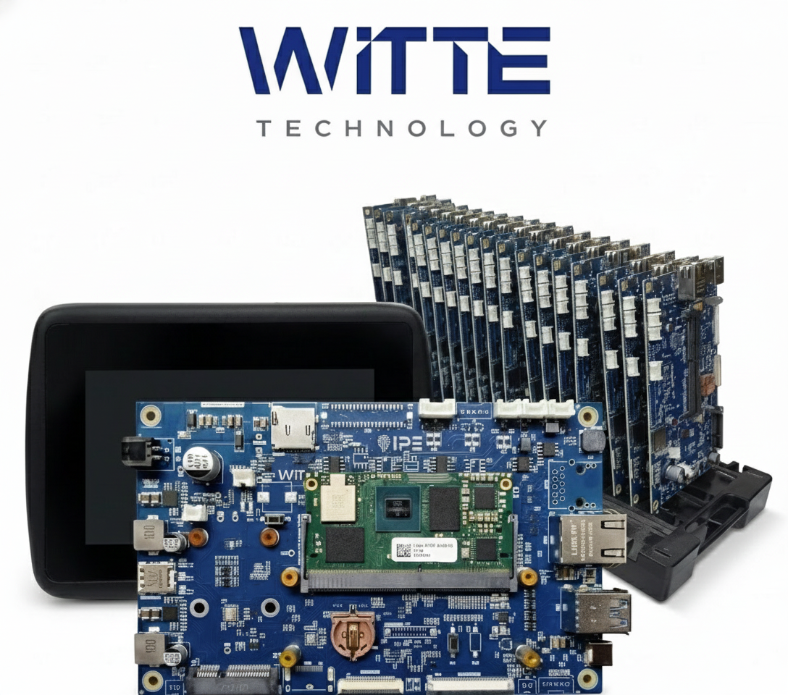

# IPE Carrier Board - Device Tree Overlays

Device Tree Overlays for the **IPE Carrier Board** by Witte Technology, compatible with Toradex Verdin modules.

<p align="center">
  
</p>

<p align="center">
  <em>IPE Carrier Board by Witte Technology</em>
</p>

## ⚠️ Important: Select the Correct Branch

This repository uses **separate branches** for each TorizonOS version. The `master` branch contains only this documentation.

### Available Branches for Verdin SoM

| Branch | Module | TorizonOS | Kernel | Status |
|--------|--------|-----------|--------|--------|
| [`toradex_6.6-2.2.x-imx`](../../tree/toradex_6.6-2.2.x-imx) | IMX8MM | 7.x (Scarthgap) | 6.6.x | ✅ Active |
| [`toradex_6.6-2.2.x-imx`](../../tree/toradex_6.6-2.2.x-imx) | IMX8MP | 7.x (Scarthgap) | 6.6.x | ✅ Active |
| [`toradex_5.15-2.2.x-imx`](../../tree/toradex_5.15-2.2.x-imx) | IMX8MM | 6.x (Kirkstone) | 5.15.x | ✅ Active |
| [`toradex_5.15-2.2.x-imx`](../../tree/toradex_5.15-2.2.x-imx) | IMX8MP | 6.x (Kirkstone) | 5.15.x | ✅ Active |


## Quick Start

### 1. Check your TorizonOS version

On your Verdin module, run:

```bash
cat /etc/os-release | grep VERSION_ID
```

### 2. Clone the correct branch

**For TorizonOS 7.x:**

Verdin IMX8 Mini or Plus:
```bash
git clone -b toradex_6.6-2.2.x-imx git@github.com:witte-technology/ipe-carrier-board.git device-trees
```

**For TorizonOS 6.x:**

Verdin IMX8 Mini or Plus:
```bash
git clone -b toradex_5.15-2.2.x-imx git@github.com:witte-technology/ipe-carrier-board.git device-trees
```

### 3. Follow the setup guide

Each branch contains a complete README with:

- Available overlays for your TorizonOS version
- Step-by-step setup instructions
- Sample `tcbuild.yaml` configuration
- Pin mapping reference

## Supported Modules

| Module | TorizonOS 7.x | TorizonOS 6.x |
|--------|:-------------:|:-------------:|
| Verdin iMX8M Plus | ✅ | ✅ |
| Verdin iMX8M Mini | ✅ | ✅ |
| Verdin AM62 | 🔜 | 🔜 |
| Verdin AM62P | 🔜 | 🔜 |

## License

SPDX-License-Identifier: MIT

## Contact

**Witte Technology LTDA**  
https://wittetech.com/
